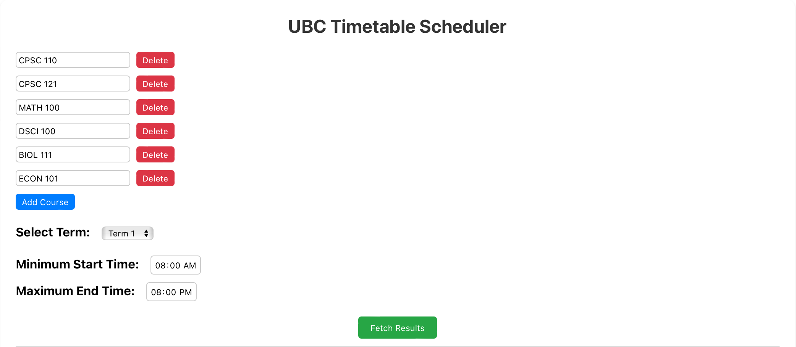
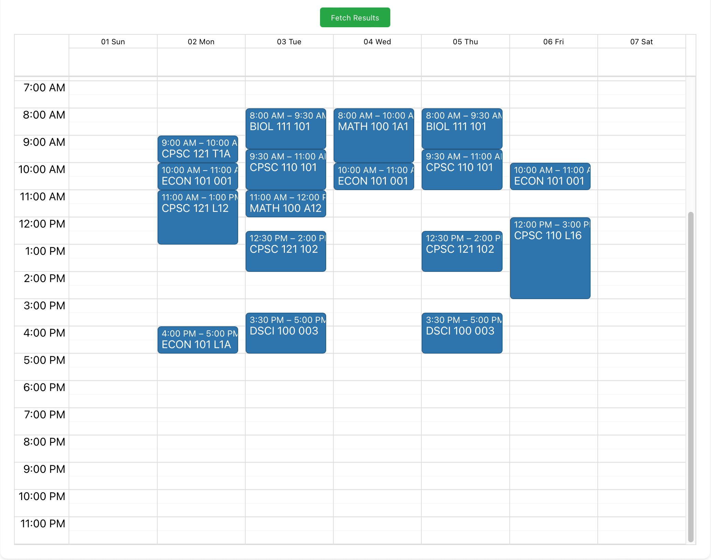

# UBCTimeTableScheduler

## Table of Contents

1. [Introduction](#introduction)
2. [Prerequisites](#prerequisites)
3. [Installation](#installation)
4. [Usage](#usage)

## Introduction

Imagine a tool that takes the hassle out of creating your university timetable – that's exactly what the UBCTimeTableScheduler does for UBC students. Gone are the days of painstakingly checking course timings and manually trying to resolve clashing schedules. With this innovative tool, you're just a few clicks away from a perfect timetable tailored to your needs.

### How It Works

1. **Input Your Courses**: Start by entering the courses you plan to enroll in. Whether it's a required major course or an elective, the scheduler accommodates them all.
2. **Prioritize Your Preferences**: Do you prefer morning classes or are you more of an afternoon person? With UBCTimeTableScheduler, you can set your preferences for class times.
3. **Let the Magic Happen**: Once your courses and preferences are in, the scheduler works its magic. Using advanced algorithms, it automatically generates a timetable that fits your courses without any time overlaps.

## Prerequisites

Before setting up the project, ensure you have the following installed:

- [Python 3](https://www.python.org/downloads/)
- [Node.js](https://nodejs.org/)

## Installation (MacOS/Linux)

Steps to run this application on you MacOS/Linux device using the terminal:

```bash
# Clone the repo
git clone https://github.com/ManDag004/UBCTimeTableScheduler.git

# Navigate to the project directory
cd UBCTimeTableScheduler/

# Make the script executable
chmod +x start.sh.

#Run the script
./start.sh
```

## Usage






